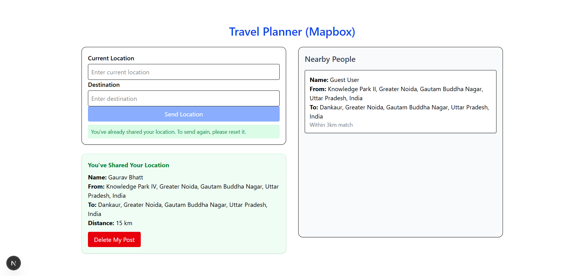

<!-- TRY IT --> 
https://cab.golu.codes

# 🚕 We Can Cab Together

**We Can Cab Together** is a location-based travel-sharing web app that helps users find others nearby who are traveling to the same destination. This makes it easier to share cabs, autos, or rickshaws and reduce costs — especially useful in urban areas like universities, tech parks, or cities.

---

## 🔍 Purpose

> Help users find and connect with others going from nearby sources to nearby destinations within a 3 km radius, enabling real-time cab-sharing decisions.

---

## 📸 Preview

 <!-- Optional: place your screenshot in project root as preview.png -->

---

## 🧱 Tech Stack

| Tech       | Purpose                                |
|------------|----------------------------------------|
| Next.js    | React-based frontend + API routing     |
| Redis      | In-memory storage of location entries  |
| Mapbox     | Location autocomplete & geo-matching   |
| TailwindCSS| Simple, responsive UI styling          |

---

## 📁 Project Structure

app/
├── (component)/home/helper/
│ ├── Dashboard.tsx # Your shared + nearby users display
│ ├── LocationForm.tsx # Main page UI
│ ├── LocationInput.tsx # Input field with suggestions
│ ├── MyLocationCard.tsx # Displays your own post
│ ├── PeopleNearbyList.tsx # List of matching people
│ └── PersonCard.tsx # Single person card
│
├── login/page.tsx # Simple login form
│
├── api/
│ ├── send-location/route.ts # POST user location
│ ├── check-location/route.ts # GET user and nearby data
│ ├── delete-location/route.ts # DELETE user's post
│ ├── get-user/route.ts # GET user from cookie
│ └── check-login/route.ts # POST login and set cookie
│
lib/
├── locationStore.ts # Add/Get/Delete logic in Redis
├── redis.ts # Redis connection config

.env # Contains Redis/Mapbox keys
globals.css # Global styles
layout.tsx # App shell
page.tsx # Default home page

yaml
Copy
Edit

---

## ⚙️ Getting Started

### 1. Clone the Repository

```bash
git clone https://github.com/golubhattuk01/we_can_cab_together.git
cd we-can-cab-together
2. Install Dependencies
bash
Copy
Edit
npm install
3. Setup Environment Variables
Create a .env file in the root:

env
Copy
Edit
NEXT_PUBLIC_MAPBOX_TOKEN=your_mapbox_token
REDIS_HOST=localhost
REDIS_PORT=6379
REDIS_PASSWORD=your_password_if_any
4. Run Redis
If not already running, install and start Redis locally:

bash
Copy
Edit
redis-server
5. Start the App
bash
Copy
Edit
npm run dev
Visit http://localhost:3000

👨‍💻 How It Works
User Login: via phone + name (cookie-based)

Location Selection: choose current & destination from autocomplete

Backend Matchmaking: check all users in Redis for same route (within 3 km)

UI Display: shows your post + list of others with matching locations

✅ Features
🔐 Cookie-based session system (secure, no database)

📍 Auto-location match within 3km (both source and destination)

🚫 One post per user — with delete/reset option

🔄 Updates in real-time after sending/resetting

🔎 Mapbox-powered search with autocomplete

💾 Redis-backed lightweight storage (fast)

🧪 Sample User Flow
Login with name and phone number

Choose "Current Location" and "Destination"

Click Send Location

View your post + others going the same way

Optionally, click Delete My Post to start over

🔐 Authentication
Auth is handled via a POST to /api/check-login

User data is saved in an HttpOnly cookie (not accessible in client-side JS)

/api/get-user retrieves the logged-in user on each load securely

📦 Deployment
You can deploy this app easily on Vercel, Render, or any platform that supports Next.js and Redis.

For production:

Use a managed Redis service (like Upstash or RedisCloud)

Secure your Mapbox token and Redis password

📜 License
MIT © [GAURAV BHATT]

📬 Contact
Feel free to raise issues or contact at youremail@example.com if you’d like to contribute, improve the UI, or build on top of this project.

yaml
Copy
Edit

---

Let me know if you'd like me to generate a **GIF preview**, a **live demo deploy guide**, or help integrate **Socket.IO for real-time updates**!


You said:
wrtie all in once so i can copy


ChatGPT said:
Sure! Here's the complete README.md content all in one place — you can copy and paste it directly into your project:

md
Copy
Edit
# 🚕 We Can Cab Together

**We Can Cab Together** is a location-based travel-sharing web app that helps users find others nearby who are traveling to the same destination. This makes it easier to share cabs, autos, or rickshaws and reduce costs — especially useful in urban areas like universities, tech parks, or cities.

---

## 🔍 Purpose

> Help users find and connect with others going from nearby sources to nearby destinations within a 3 km radius, enabling real-time cab-sharing decisions.

---

## 🧱 Tech Stack

| Tech       | Purpose                                |
|------------|----------------------------------------|
| Next.js    | React-based frontend + API routing     |
| Redis      | In-memory storage of location entries  |
| Mapbox     | Location autocomplete & geo-matching   |
| TailwindCSS| Simple, responsive UI styling          |

---

## 📁 Project Structure

app/
├── (component)/home/helper/
│ ├── Dashboard.tsx # Your shared + nearby users display
│ ├── LocationForm.tsx # Main page UI
│ ├── LocationInput.tsx # Input field with suggestions
│ ├── MyLocationCard.tsx # Displays your own post
│ ├── PeopleNearbyList.tsx # List of matching people
│ └── PersonCard.tsx # Single person card
│
├── login/page.tsx # Simple login form
│
├── api/
│ ├── send-location/route.ts # POST user location
│ ├── check-location/route.ts # GET user and nearby data
│ ├── delete-location/route.ts # DELETE user's post
│ ├── get-user/route.ts # GET user from cookie
│ └── check-login/route.ts # POST login and set cookie
│
lib/
├── locationStore.ts # Add/Get/Delete logic in Redis
├── redis.ts # Redis connection config

.env # Contains Redis/Mapbox keys
globals.css # Global styles
layout.tsx # App shell
page.tsx # Default home page

yaml
Copy
Edit

---

## ⚙️ Getting Started

### 1. Clone the Repository

```bash
git clone https://github.com/golubhattuk01/we_can_cab_together.git
cd we-can-cab-together
2. Install Dependencies
bash
Copy
Edit
npm install
3. Setup Environment Variables
Create a .env file in the root:

env
Copy
Edit
NEXT_PUBLIC_MAPBOX_TOKEN=your_mapbox_token
REDIS_HOST=localhost
REDIS_PORT=6379
REDIS_PASSWORD=your_password_if_any
4. Run Redis
If not already running, install and start Redis locally:

bash
Copy
Edit
redis-server
5. Start the App
bash
Copy
Edit
npm run dev
Visit http://localhost:3000

👨‍💻 How It Works
User Login: via phone + name (cookie-based)

Location Selection: choose current & destination from autocomplete

Backend Matchmaking: check all users in Redis for same route (within 3 km)

UI Display: shows your post + list of others with matching locations

✅ Features
🔐 Cookie-based session system (secure, no database)

📍 Auto-location match within 3km (both source and destination)

🚫 One post per user — with delete/reset option

🔄 Updates in real-time after sending/resetting

🔎 Mapbox-powered search with autocomplete

💾 Redis-backed lightweight storage (fast)

🧪 Sample User Flow
Login with name and phone number

Choose "Current Location" and "Destination"

Click Send Location

View your post + others going the same way

Optionally, click Delete My Post to start over

🔐 Authentication
Auth is handled via a POST to /api/check-login

User data is saved in an HttpOnly cookie (not accessible in client-side JS)

/api/get-user retrieves the logged-in user on each load securely

📦 Deployment
You can deploy this app easily on Vercel, Render, or any platform that supports Next.js and Redis.

For production:

Use a managed Redis service (like Upstash or RedisCloud)

Secure your Mapbox token and Redis password

📜 License
MIT © [GAURAV BHATT]

📬 Contact
Feel free to raise issues or contact at youremail@example.com if you’d like to contribute, improve the UI, or build on top of this project.

yaml
Copy
Edit

---

Let me know if you want to add badges, a project banner, or a one-click **Vercel deploy button** to this [GitHub README](f).